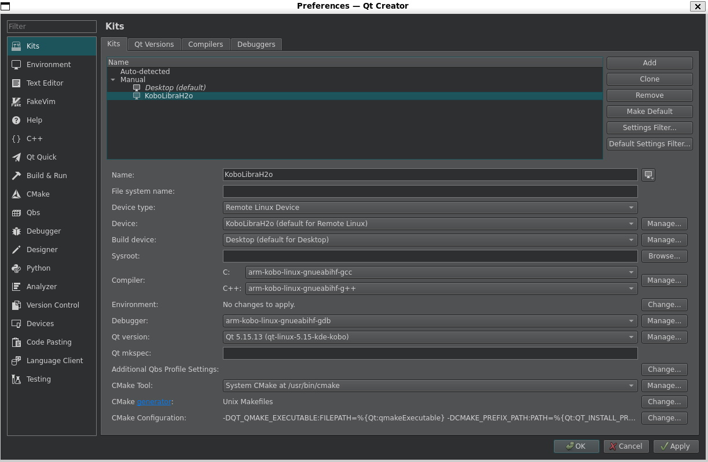

### How to develop for Kobo ?

You can setup a very basic Kobo dev environment by following either 
- The <a href="https://github.com/koreader/koxtoolchain">koxtoolchain instructions</a> and work your way from here by cross-compiling qt for ARM and the QTPA kobo platform plugin. To validate your arm gcc, run your first non graphical "hello world" throught an ssh-server or use koreader "run command" option.
- Go the "easy" route and use my fork of @Rain92's <a href="https://github.com/Aryetis/kobo-qt-setup-scripts">kobo-qt-setup-scripts</a> (until I eventually find time to write a clean PR for the main repository) to setup everything "libs, Qt binaries, deployment scripts".

### How to setup Obenkyobo dev environment using kobo-qt-setup-scripts ? (as of 04/04/2024, tested with WSL2 Debian Bookworm ) 
1. Run the following commands :
```
sudo apt-get install build-essential autoconf automake bison flex gawk libtool libtool-bin libncurses-dev curl file git gperf help2man texinfo unzip wget cmake pkg-config python3 mmv lftp
git clone --recurse-submodules git@github.com:Aryetis/kobo-qt-setup-scripts.git # or "git clone --recurse-submodules https://github.com/Aryetis/kobo-qt-setup-scripts.git", if you don't use ssh keys for github
cd kobo-qt-setup-scripts
./install_toolchain.sh
./get_qt.sh kobo # at this point check the "How to build and get docs working in QTCreator" section if you want to build qt docs too
./install_libs.sh
echo $'\n########################################' >> ~/.bashrc
echo 'export PATH="$HOME/x-tools/arm-kobo-linux-gnueabihf/bin:$PATH"' >> ~/.bashrc
source ~/.bashrc
./build_qt.sh kobo config
./build_qt.sh kobo make
./build_qt.sh kobo install
```

That should get you a working cross commpiler and qt binaries configured with a bunch of libraries (most of them only useful for UltimateMangaReader)

2. Time to get Obenkyobo's repository : 
- `git clone --recurse-submodules git@github.com:Aryetis/Obenkyobo.git` (or `git clone --recurse-submodules https://github.com/Aryetis/Obenkyobo.git` if you don't use ssh keys for github)
- And then simply open its `ObenkyoboProject.pro` file with QtCreator. Once there you'll have to setup a "kit" using the arm-kobo-linux-gnueabihf-gcc/g++ and qt binaries compiled above. cf screenshot below.

<p align="center">
  
</p>

- Once you've compiled Obenkyobo (and therefore qtpa too), time to run the `deploy_qt.sh QTPA_BUILD_FOLDER [KOBO_IP_DEVICE]` script with `QTPA_BUILD_FOLDER`as the folder holding libkobo.so and leave KOBO_IP_DEVICE empty as we'll ship everything using rsync/sftp directly from QtCreator. This should create the `/kobo-qt-setup-scripts/deploy/qt-linux-5.15-kde-kobo/` folder containing every qt binaries and libraries to be deployed on the kobo device. Make sure to fix the associated symbolic link `Obenkyobo/Src/Obenkyobo/OtherFiles/Dependencies/qt-linux-5.15-kde-kobo` so that it points towards `kobo-qt-setup-scripts/deploy/qt-linux-5.15-kde-kobo/` (that way packager.sh will be able to include it). 

3. And finally, let's tweak a couple of things so you can use the packager.sh to compile and ship everything with a single press on the build button (also requires you to follow `Setup QtCreator` steps)
- Create a symbolic link to the qt binaries like so : `ln -s [Obenkyobo]/Src/Obenkyobo/OtherFiles/Dependencies/qt-linux-5.15-kde-kobo` -> `[kobo-qt-setup-scripts]/deploy/qt-linux-5.15-kde-kobo/`
- Modify `ObenkyoboProject/Src/Obenkyobo/Obenkyobo.pro` to set what part of the project you actually want to ship over sftp : 
```
INSTALLS += target everything thumbnail # will ship everything (you probably want to do this at first then switch to the last one)
INSTALLS += target everythingButLibs thumbnail  # ship everything but libraries/dependencies
INSTALLS += target everythingButLibsAndSh #s ship everything but libraries/dependencies and the Obenkyobo_launcher.sh
INSTALLS += target everything thumbnail # use only this for full deploy, to save time set it to += target afterwards  
INSTALLS += target # will only ship Obenkyobo's binary
```

### Setup QtCreator

For a better workflow and one click build+deploy+launch from within QtCreator : 
```
Settings->Build & Run->Default Build Properties->Default build directory  : 
%{JS: Util.asciify("build-%{Project:Name}-%{Kit:FileSystemName}-%{BuildConfig:Name}")}

# If QtCreator < 13
Projects->Kobo(Kit)->Run->Deployment->Upload files via SFTP instead of rsync
# If QtCreator == 13, install rsync and 
Projects->Kobo(Kit)->Run->Deployment->Deploy files and set flags for rsync : --chown=root:root
(can't pass more than one argument without everyhing breaking apart because of how they pass the arguments --")

Projects->Kobo(Kit)->Run->Deployment-> Add Run custom remote command with :  
/mnt/onboard/.adds/Obenkyobo/debugEnv.sh

Projects->Kobo(Kit)->Run->Environment->(System Environment)->Add create new variable with at least 
LD_LIBRARY_PATH = /mnt/onboard/.adds/qt-linux-5.15-kde-kobo/lib:lib:
QT_QPA_PLATFORM = kobo
```

The preparation of the files for sftp transfer (and creationg of a .zip file for release) should be handled by the `Src/Obenkyobo/OtherFiles/packager.sh` (triggered by Obenkyobo.pro's QMAKE_POST_LINK action)

And that's it! With all of that done, you should now be able to simply click the "Run" button to compile and send eveything necessary to your kobo device over the air.

Also, NEVER modify any of the .sh scripts under windows... Windows end of line will mess things up when ran on linux, or at the very least use `win2unix` afterwards to fix line endings issues.

If for some reasons you need to debug QtCreator's behavior (cough cough), run `export QT_LOGGING_RULES=qtc.*=true` before it.

ps : `apt-get install fonts-takao-mincho` to make sure you have at least one set of font capable of displaying japanese.

### Setup gdb

Two solutions : 
- Use cross compiled arm gdb from <a href="https://github.com/Rain92/kobo-qt-setup-scripts">kobo-qt-setup-scripts</a>. 
```
sudo apt install python3-dev libgmp-dev
cd kobo-qt-setup-scripts
./install_gdb.sh
```
- Install gdb-multiarch, select it in your qt kit and set it up for arm architecture in QtCreator by :  `Tools->Options->Debugger->GDB->Additional Startup Commands : -q --nh -ex 'set architecture arm'`

Please note that there is a <a href="https://bugreports.qt.io/browse/QTCREATORBUG-28505">bug</a> in QtCreator v8 and v9 with gdb's "Debugging Helper". Therefore if like me you re using Debian wsl2, you ll be stuck with a bugged version. Here's three proper solutions :
- Fix the bug manually by following <a href="https://microhobby.com.br/blog/2023/08/08/qt-creator-v9-0-2-debug-helpers-not-working-on-ubuntu-23-04-and-debian-bookworm-12/">this tutorial</a>
- Update to Trixie/unstable which has QtCreator v10.0.2-4. (seems to cause issue with ./install_toolchain.sh ? Will investigate when Trixie is out of testing phase)
- Download standalone QtCreator from <a href="https://download.qt.io/official_releases/qtcreator/">offline installers</a>, in theory it shouldn't mix with system libs and packages... I'm not too fond of it but it looks likes the best bet for now. Here's a bunch of things you'll need to intall to make it work (might be missing some I didn't took notes) 
`sudo apt install libxkbcommon-x11-0 libxcb-shape0 libxcb-render-util0 libxcb-keysyms1 libxcb-image0 libxcb-icccm4 libdbus-1-dev libwayland-cursor0 libxaw7 libxmu6 libxt6 libxtst6` . To create star menu entry for it (and others wsl apps) create a file `/usr/share/applications/qtcreator-13.desktop` and fill it like so. (And throw the icons from "DevReadme/QtCreatorIcons.zip" into `/usr/share/icons/hicolor`)
```
[Desktop Entry]
Name=qtcreator
Icon=QtProject-qtcreator
Comment=QtCreator-13.0.0 Qt IDE
Exec="/home/aramir/qtcreator-13.0.0/bin/qtcreator" %f
Version=13.0.0
Type=Application
Categories=Development;IDE;
Terminal=false
StartupNotify=true
```

### Setup the Ereader

Setup a fixed IP address for it and use it in <a href="https://github.com/Rain92/kobo-qt-setup-scripts">kobo-qt-setup-scripts</a>  deploy_script.sh if you go this route instead of using QtCreator

Ereader is rebooting upon Deployment ? Probably because kfmon/nm is scanning for the freshly installed/deployed stuff and reboots the device to update its nickelMenu entry. You should probably setup only select INSTALLS += target , when working daily

Please note that the wifi indicator on your kobo can sometimes lie to you. To fix this you can either : 
- Turn on developer mode on the kobo by searching for a book named `devmodeon`, then force the wifi to stay on during dev session : Plus->Parameters->Technical informations->Developer options->force Wifi ON. 
- Simply tap the wifi signal icon and keep its wifi list widget open, this should work 99% of the time.

Install <a href="https://www.mobileread.com/forums/showthread.php?t=254214">Niluje's kobo stuff</a> package to get various programs running on the kobo such as : 
- `dropbear` ssh server (connect with root and empty password)
- `nano`, `gdb`, `strace`
- `fbgrab picture.png` to take screenshots
- etc 

### Miscellaneous

How to read the backtrace logs : convert address to line using `addr2line -e [NonStrippedProgramBinary] [HexAddress]`

### How to serial connect to Kobo ereader in WSL2 

1. install usbipd on windows's side to share usb device through IP with WSL2, more info on <a href="https://github.com/dorssel/usbipd-win/wiki/WSL-support">WSL-support's page</a> and <a href="https://learn.microsoft.com/fr-fr/windows/wsl/connect-usb#attach-a-usb-device.">this windows's doc page</a>.
2. install bunch of necessary software in WSL2 with : 
`sudo apt install usbip hwdata usbutils setserial`
3. In some Admin Powershell (urgh), lis usb devices busids with : `usbipd list`
4. link usb device to WSL2 with `usbipd wsl attach --busid [BUS_ID]; usbipd attach --wsl --busid [BUS_ID]`
5. check with `lsusb` if you're device shows up and if `/dev/ttyUSBxxx` entry is created. If not ... guess what ... WSL2 kernel probably doesn't have your device's driver. To be sure, check it out with `ls -l /sys/bus/usb-serial/drivers`. You'll have to build your own kernel then, cf section below.

### How to build custom WSL2 kernel 

1. `sudo apt install build-essential flex bison libssl-dev libelf-dev git dwarves`
2. `git clone https://github.com/microsoft/WSL2-Linux-Kernel.git`
3. `cd WSL2-Linux-Kernel`
4. `cp Microsoft/config-wsl .config` (might as well change CONFIG_LOCALVERSION in it while you're at it so you can differentiate your kernel later on)
5. `make menuconfig`
6. Enable your driver : `Device Drivers -> USB Support -> USB Serial Converter support -> [whatever device you're using] + [USB Serial Console device support] + [USB Generic Serial Driver]`. It's your choice but you might as well make it "built-in" to make your life easier (marked with a `*`). In my case, the necessary driver is "USB Prolific 2303 Single Port Serial Driver"
7. `make -j xxx` (xxx being how many cores you want to build with)
8. `cp arch/x86/boot/bzImage /mnt/c/Users/[USER_NAME]/wsl_kernel`
9. Create the following file `C:\Users\<UserName>\.wslconfig with this content` : 
```
[wsl2]
kernel=C:\\Users\\aramir\\wsl_kernel\\bzImage
```
10. in powershell/cmd `wsl --shutdown` (just to be sure)
11. relaunch your WSL2 and check out your new kernel with : `uname -a` 
12. connect to your kobo with the usual `sudo minicom -D /dev/ttyUSB0` and voila !

### Which serial port should I solder my UART to debug over wire ?

This <a href="https://web.archive.org/web/20220627124323/http://gethighstayhigh.co.uk/kobo-self-build/">gethighstayhigh blog entry</a> used to host references for a lot of Kobo internal layout. Thanks ! 

But for prosperity I saved all the layout pictures in the "DevReadme" folder. And here's what the "serial port" section used to say:
```
Most Kobo's typically have 3 or 4 serial ports, but only one is functional. The serial ports on 6 popular models can be seen in the photographs. Each Serial port has 4 connections,

V         (Power)
Ground
Data in   (or Rx)
Data Out  (or Tx).

Not all instruments require all 4 connections (In our UART debugging case you probably don't need 5v). The ground connection is connected to the wider copper 'ground' of the entire PCB, which means that the heat from a soldering iron is wicked away fast which can compromise a good joint. Instead, it is recommended that the ground is connected to the nearest PCB screw for a more reliable connection.

For the 2020 Kobo Nia. Note that wiring from the 'other’'end (see Clara, below) was susceptible to EMF.

Layout on older Kobo models; the cables colours are: White is V, Yellow is Ground, Black is Data-In/Rx**, Red is Data-Out/Tx**
**at the 'kobo' end
```

### Some Power Consumption measurements (needs to be redone with a proper methodology later on !!!)
```
Consumption at sleep and 100% battery (numbers read after a minute of stabilized consumption at most... Needs to redo tests with stricter methodology) : 
============= Kobo Glo HD =============
Nickel : 0.0129 A (takes a little longer to stabilize)
Obenkyobo : 0.0129 A (after the minute of Fake Sleep)
============== Kobo Glo ===============
Nickel : 0.0100 A (stable)
Obenkyobo : 0.0101 A ( (after the minute of Fake Sleep))
Inkbox OS : 0.0101 A (after enabling "sleep while charging" in experimental settings)
=========== Kobo Libra h2o ============
Nickel : 0.0102 A (takes longer to stabilize) 
Obenkyobo : 0.0101 A ( (after the minute of Fake Sleep)) 
UMR : 0.0425 -> 0.0429 A (oscillation for long time) then 0.0103 A
```

### How to build and get docs working in QTCreator

- The <a href="https://wiki.qt.io/Building_Qt_Documentation">official</a> (yet broken) way : 

```
sudo apt install llvm libclang-dev
cd [...]/kobo-qt-setup-scripts/
#add `qttools qtdoc` to MODULES_BASE in get_qt.sh`
./get_qt.sh
./build_qt.sh kobo config (Should state "QtTools\n QtDocs ...... ok" at the end of the summary)
./build_qt.sh kobo make
./build_qt.sh kobo install
cd [...]/kobo-qt-setup-scripts/qt-linux-5.15-kde-kobo
cd [...]/kobo-qt-setup-scripts/qt-linux-5.15-kde-kobo/qttools/src/assistant
make sub-qhelpgenerator
make sub-qhelpgenerator-install_subtargets
cd [...]/kobo-qt-setup-scripts/qt-linux-5.15-kde-kobo/qtdeclarative/src
make sub-qmldevtools
make sub-qmldevtools-install_subtargets
cd [...]/kobo-qt-setup-scripts/qt-linux-5.15-kde-kobo/qttools/src
make sub-qdoc
make sub-qdoc-install_subtargets
cd /home/aramir/kobo-qt-setup-scripts/qt-linux-5.15-kde-kobo/qtbase
make docs # it's gonna take about 30 minutes... yes for real...
find ./ -name "*.qch" | grep doc
# Open QtCreator, Edit -> Preferences -> Help -> Documentation and add have fun adding every single .pch listed by the command above :D (qtcore and qtdoc are the two main ones)
```

- The dirty (yet working) way

```
ln -s /usr/lib/qt6/bin/qdoc /home/aramir/qt-bin/qt-linux-5.15-kde-kobo/bin/qdoc
ln -s /usr/lib/qt6/libexec/qtattributionsscanner /home/aramir/qt-bin/qt-linux-5.15-kde-kobo/bin/qtattributionsscanner
ln -s /usr/lib/qt6/libexec/qhelpgenerator /home/aramir/qt-bin/qt-linux-5.15-kde-kobo/bin/qhelpgenerator
cd [...]kobo-qt-setup-scripts/qt-linux-5.15-kde-kobo/qtbase
mkdir LICENSES
touch LICENSES/NONE.txt
cd ..
make docs # it's gonna take about 30 minutes... yes for real...
find ./ -name "*.qch" | grep doc
# Open QtCreator, Edit -> Preferences -> Help -> Documentation and add have fun adding every single .pch listed by the command above :D
# Ok time to clean our mess
rm /home/aramir/qt-bin/qt-linux-5.15-kde-kobo/bin/qdoc
rm /home/aramir/qt-bin/qt-linux-5.15-kde-kobo/bin/qtattributionsscanner
rm /home/aramir/qt-bin/qt-linux-5.15-kde-kobo/bin/qhelpgenerator
```

- The lazy way, use the compiled .qch (for qt 5.15.13) I've put in the <a href="DevReadme/qt-docs-5.15.13">DevReadme folder</a>

Now when selecting a QtClass in your code and pressing f1 it should display the local doc associated to said QtClass.

QtCreator freezes a lot when loading some huge documentation page (eg : QString) ? Congratulations you've encountered yet another qt/wsl bug. To counter this bug this one : Edit->Preferences->Help->Viewer Backend : QTextBrowser. Oh ? What's that ? Now every doc page is flashbang white ? To counter this one you'll simply have to change the stylsheet used by QtCreator using an undocumented launch argument :D. `qtcreator -stylesheet blabla.css/blabla.qss` but don't worry it gets even more stupid! The stylesheet can even be a blank file and it should still override whatever the default stylesheet is and work just fine. So if you're using wsl2 like me, run `touch EmptyTheme.css` along qtcreator binary, right click your windows qtcreator shortcut/startbar pin->properties->target : `"C:\Program Files\WSL\wslg.exe" -d Debian --cd "~" -- "~/qtcreator-13.0.0/bin/qtcreator" -stylesheet ~/qtcreator-13.0.0/bin/EmptyTheme.css`