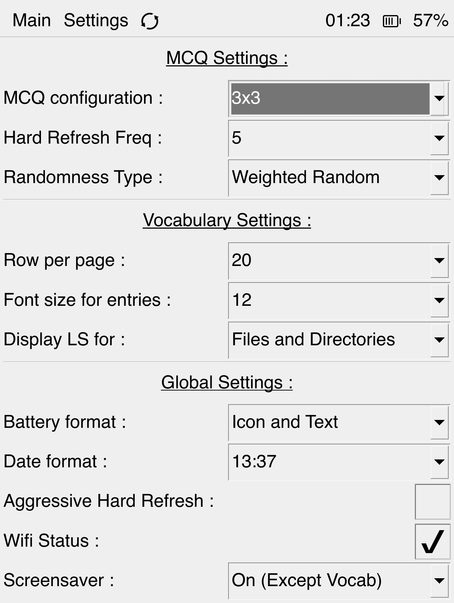
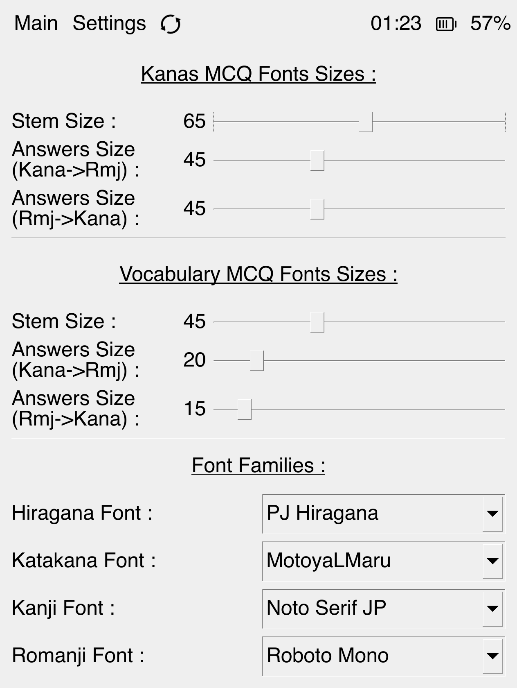
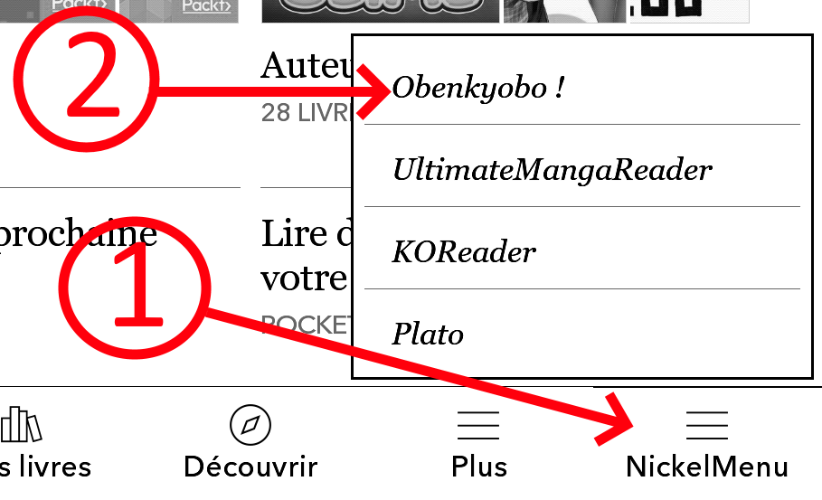

# Obenkyobo

## What is it ?

Obenkyobo is an application for kyobo ereaders designed to help you memorize Hiraganas, Katakanas and vocabulary. 

It is very inspired by an Android application called <a href="https://play.google.com/store/apps/details?id=com.Obenkyo">Obenkyo, available at google play</a>. I have no affiliation with Obenkyo whatsoever. But check it out it's free and worth your time too if you can resist the urge to procrastinate on your samrtphone instead of studying.

## How does it look ?
<p align="center">
  
  
  
  
  
  
  
  
  
  
  
  
</p>
More screenshots : <a href="https://github.com/Aryetis/Obenkyobo/tree/master/Screenshots">here</a>

## Any demo video ? Settings Explanations ?

https://user-images.githubusercontent.com/4246001/197065422-db6f3642-189e-4b5f-9f7d-373bd2ce00aa.mp4

[Youtube link (better video quality)](https://www.youtube.com/watch?v=NnxOF-2C12I)

## Features ?

Here's what available currently :
- Hiragana/Katakana/Vocabulary <-> Romanji customizable MCQ
- Vocabulary sheet system (create your owns sheets, read them, randomize them, hide columns/items, etc)
- Learning Score (LS) System (Weighted random) for each Hiragana/Katakana to keep MCQ more entertaining
- Quality of Life features such as; multiple fonts, font settings, screen options (Luminosity/Tint) support, physical buttons support, fully customizable MCQ, etc
- Wifi support
- Sleep support (sleep cover supported) 

Tested and working on : 
- Libra Colour (please use <a href="https://github.com/Aryetis/Obenkyobo/releases/tag/v0.4.0">v0.4.0 pre-release</a> for now)
- Clara Colour (please use <a href="https://github.com/Aryetis/Obenkyobo/releases/tag/v0.4.0">v0.4.0 pre-release</a> for now)
- Libra h2o
- Forma
- Mini (might have minor UI scaling issues)
- Glo
- Glo HD
- Clara HD
- Please report if it works for your model too

## How to install ?

Firstly, this application is designed to be compatible with most (except some new models) Kobo devices with a recent firmware (probably 4.6+). Do not try to install it for other ereader, it will not work ! This application is provided "as is". Don't come to me if somehow your device catch on fire after installing this.

Secondly, you'll need to install a "launcher" beforehand. Common options are : 
- <a href="https://github.com/pgaskin/NickelMenu">NickelMenu (NM)</a>, recommended option
- <a href="https://github.com/NiLuJe/kfmon">Kute File Monitor (KfMon)</a>

Once you're done installing at least one, connect your ereader to your computer, open the following file on it `.kobo/Kobo/Kobo eReader.conf` and add this at the end of it. 
```
[FeatureSettings]
ExcludeSyncFolders=\\.(?!kobo|adobe).*?
```
This should prevent your ereader library from picking up any undesired pictures in hidden folders.

Then all you have to do is :
- download the archive  <a href="https://github.com/Aryetis/Obenkyobo/releases">Obenkyobo_AIO_Release_V\*.\*.\*.zip</a> 
- connect the ereader to your computer and extract the package at its root.

 It should work "as is" assuming you're using NickelMenu. If you're using KfMon you'll have to uncomment the associated entry file (`.adds/kfmon/config/Obenkyobo.ini`) by removing one of the `;` located at the start of each line. And you might want to delete the useless NickelMenu entry too `.adds/nm/Obenkyobo`

If you're only updating Obenkyobo, you can try to install the "light" version of the archive instead.  <a href="https://github.com/Aryetis/Obenkyobo/releases">Obenkyobo_Light_Release_V*.*.*.zip</a>.  This version is stripped from qt packages you already installed with the previous AIO version and should work fine for updating except if told otherwise.


<br/>
<br/>
<br/>
And voilà ! You should now have a NickelMenu entry at the bottom right corner of your ereader "home screen" and/or a new "book" in your library to open with KfMon.
<br clear="left"/>

## How to create my vocabulary sheets ?

Each ****.oben file  in `.adds/Obenkyobo/vocab` is a Vocabulary sheet. Depending of your operating system, you might have to <a href="https://www.google.com/search?client=firefox-b-d&q=enable+hidden+files+">enable "hidden files"</a> to see those directories. I encourage you to write your owns, searching for new words and writing sheets is also part of the learning process.
To make your own sheet, create a file and follow the same template as the default ones.

Each line should follow this format : `[fontType=hiragana][jp=いぬ][kanji=犬][trad=dog][learningScore=5]`

Provided Vocabulary Sheets can be found on this repository at <a href="https://github.com/Aryetis/Obenkyobo/tree/master/Src/Obenkyobo/OtherFiles/vocab">this page</a>

You can insert commentary line by having it start with a `#`.

Possible values for fontType are `hiragana, katakana`, it will determine what font is used in Obenkyobo to display this entry's `jp` value.

LearningScore (LS)'s value ranges from 0 to 5, please note that the value actually registered in the file is inversed from what is displayed in Obenkyobo. Therefore you should probably put 5 for each new Entry.

Feel free to share your own Vocabulary Sheets in [Obenkyobo's mobileread thread](https://www.mobileread.com/forums/showthread.php?p=4162746)

If your file is misinterpreted in Obenkyobo, please make sure your text editor (notepad++, sublimeText, etc) is saving the file in UTF-8 format.

## Issues ? 

If you encounter any issues, please report them by either : 
- Creating a new Ticket on Github <a href="https://github.com/Aryetis/Obenkyobo/issues">here</a> describing your issue as precisely as possible, include the type of ereader your using and the log.txt at `/.adds/Obenkyobo/log.txt` (it erases itself at each launch, so don't restart Obenkyobo right after a crash ! Save the `log.txt` beforehand, thanks.)
- Respond in Obenkyobo's MobileRead thread <a href="https://www.mobileread.com/forums/showthread.php?p=4162746">MobileRead thread</a> in the same way.


## Thanks

Thank you for actually reading a readme file.

And big big thanks to <a href="https://github.com/Rain92/">@Rain92/OfficerAction</a> , <a href="https://github.com/NiLuJe">@NiLuJe</a>, <a href="https://github.com/tux-linux">@NiMa</a> and <a href="https://github.com/Szybet">@Szybet</a> for putting up with me on Discord, helping me setup my environment, walking me throught some Qt Kobo specific minefields and creating all those nice tools/libraries like QPA allowing me to develop this app.

## Resources licensing (fonts, icons, pictures)

Every resource used in this software is "free-to-use and share in any way" (tldr version). Still, credit is given where credit is due. You can find the details about who made what in the following file. I m not a lawyer, trying my best to play by the rules there... 
<a href="https://github.com/Aryetis/Obenkyobo/blob/master/Src/Obenkyobo/Resources/LICENSES">Resources Licenses and Details</a>

## For developpers, dummies, and future me. How to compile it ? And other dev related tricks and whatnot.

Please check the [DevReadme.md ](DevReadme.md) file.

